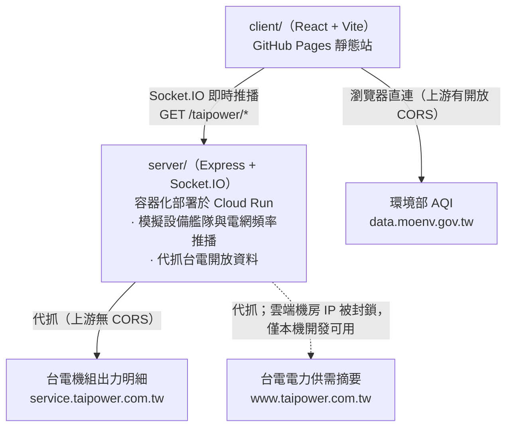
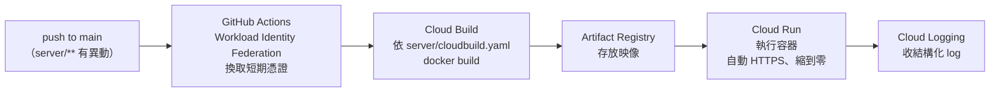

# EcoGrid EMS

台灣電網即時監控儀表板（Energy Management System）。以模擬的分散式能源設備艦隊，搭配台電與環境部的公開資料，示範一套 EMS 前端該有的樣子：即時推播、大量設備清單、告警管理與地理分布。

線上展示：<https://usyuan.github.io/eco-grid-ems/>

> 展示站的即時資料（電網頻率、設備、告警）來自部署在 Cloud Run 的模擬後端。**需先完成 [docs/gcp-deploy.md](docs/gcp-deploy.md) 的一次性設定、並把服務網址填進 repo variable `VITE_SERVER_URL`**，在那之前線上這些數字不會更新。台電**電力供需摘要**線上取不到（台電封鎖雲端機房 IP，只有本機開發時拿得到）；其餘功能與本機一致。原因見〈架構〉。

## 功能

| 頁面 | 內容 |
|---|---|
| 儀表板 `/` | 四張 KPI（總發電輸出、電網頻率、上線設備數、未處理告警）、每秒更新的頻率折線圖、發電占比圓餅圖、台電供需摘要與機組出力、最近測站空氣品質 |
| 環境地圖 `/map` | 全台約 84–86 個環境部測站標在 Google 地圖上，可切換 AQI / PM2.5 / PM10 / O₃(8hr)；縮放層級低時自動聚合成縣市 marker |
| 設備管理 `/equipment` | 102 台模擬設備（太陽能、風機、儲能、變流器、電表）的清單，狀態篩選、關鍵字搜尋、虛擬滾動、點擊看詳情 |
| 告警紀錄 `/alerts` | 可排序分頁的告警表格，等級篩選、單筆／全部確認、匯出 CSV |

## 架構



- `server/` 是純記憶體的模擬服務，**沒有資料庫**，重啟即歸零。只做兩件事：用 Socket.IO 推播模擬的設備狀態與電網頻率，以及代抓瀏覽器打不通的台電開放資料。
- `server/` 以 `--max-instances=1`、`--min-instances=0` 跑在 Cloud Run 上：沒人連線時縮到零（不計費，第一次連上需要幾秒喚醒），且刻意只開一個 instance——模擬艦隊是行程內狀態，多開會讓不同使用者看到不同資料。
- 台電電力供需摘要（`www.taipower.com.tw`）的 WAF 封鎖雲端機房 IP——實測連 GCP 台灣機房都被擋，換地區也沒用——所以只有本機開發（從住宅網路發出）拿得到，線上那張卡片會是錯誤狀態。這是已知限制，不是疏漏；判斷流程見 [CLAUDE.md](CLAUDE.md)。

## 快速開始

需要 Node 22+ 與 pnpm 11+。

```bash
pnpm install
pnpm dev
```

`pnpm dev` 會同時啟動後端（`http://localhost:4000`）與前端（`http://localhost:5173`）。也可以分開跑：

```bash
pnpm dev:client
pnpm dev:server
```

前端環境變數（環境部 API 金鑰、Google Maps 金鑰）的設定方式見 [client/README.md](client/README.md)；未設定不影響其他頁面啟動。

## 部署

兩個 package 各有一條獨立的 workflow，依異動路徑分別觸發。

| 產物 | Workflow | 目的地 | 觸發路徑 |
|---|---|---|---|
| `client/` | [deploy-client-pages.yml](.github/workflows/deploy-client-pages.yml) | GitHub Pages | `client/**` |
| `server/` | [deploy-cloud-run.yml](.github/workflows/deploy-cloud-run.yml) | Cloud Run | `server/**` |

後端這條走完整的容器流程，四個 GCP 服務各司其職：



GitHub 這側要設定的東西（repo Settings → Secrets and variables → Actions）：

| 類型 | 名稱 | 用途 |
|---|---|---|
| Secret | `VITE_MOENV_API_KEY` | 環境部開放資料 API 金鑰 |
| Secret | `VITE_GOOGLE_MAPS_API_KEY` | 地圖頁 |
| Secret | `VITE_GOOGLE_MAPS_MAP_ID` | 地圖頁（Advanced Marker 需要向量地圖） |
| Secret | `GCP_WIF_PROVIDER` | Workload Identity Federation provider 資源名稱 |
| Secret | `GCP_SERVICE_ACCOUNT` | 部署用 service account |
| Variable | `GCP_PROJECT_ID` | GCP 專案 ID |
| Variable | `VITE_SERVER_URL` | Cloud Run 的 `*.run.app` 網址，前端據此連後端 |
| Variable | `CLIENT_ORIGIN` | 選填，後端的 CORS 白名單；預設 `https://usyuan.github.io` |

- 前端金鑰的申請與限制設定步驟見 [client/README.md](client/README.md)。
- GCP 那側的一次性設定、免費額度與成本守則見 [docs/gcp-deploy.md](docs/gcp-deploy.md)。**整條線可以完全落在 GCP 免費額度內**，但有幾個參數碰了就會開始計費，該文件有列。
- 改 `VITE_SERVER_URL` 不會自動觸發前端重新建置，要手動重跑一次 Pages 的 workflow。

## 專案結構

```
client/     React 19 + Vite 前端，部署到 GitHub Pages
server/     Express + Socket.IO 模擬後端，容器化部署到 Cloud Run
docs/       開發歷程與決策紀錄
```

| 文件 | 內容 |
|---|---|
| [client/README.md](client/README.md) | 前端技術選型、功能細節、環境變數與金鑰申請 |
| [client/CLAUDE.md](client/CLAUDE.md) | 前端開發參考：構件規範、目錄結構、資料流向、踩坑 |
| [server/README.md](server/README.md) | 後端職責、端點與模擬資料行為 |
| [server/CLAUDE.md](server/CLAUDE.md) | 後端開發參考：事件契約、代理限制、模擬資料行為 |
| [CLAUDE.md](CLAUDE.md) | 跨 package 的開發參考 |
| [docs/gcp-deploy.md](docs/gcp-deploy.md) | 後端部署：GCP 一次性設定、Docker 流程、免費額度與成本守則 |
