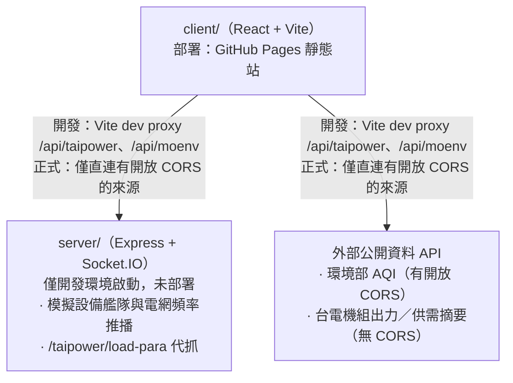

# EcoGrid EMS

台灣電網即時監控儀表板（Energy Management System）。以模擬的分散式能源設備艦隊，搭配台電與環境部的公開資料，示範一套 EMS 前端該有的樣子：即時推播、大量設備清單、告警管理與地理分布。

線上展示：<https://usyuan.github.io/eco-grid-ems/>

> 正式環境是純靜態站（未部署後端），因此**電網頻率、設備、告警等即時資料在線上展示中不會更新**，僅環境部空氣品質為真實資料。完整功能需在本機同時啟動 `client` 與 `server`，原因見〈架構〉。

## 功能

| 頁面 | 內容 |
|---|---|
| 儀表板 `/` | 四張 KPI（總發電輸出、電網頻率、上線設備數、未處理告警）、每秒更新的頻率折線圖、發電占比圓餅圖、台電供需摘要與機組出力、最近測站空氣品質 |
| 環境地圖 `/map` | 全台約 84–86 個環境部測站標在 Google 地圖上，可切換 AQI / PM2.5 / PM10 / O₃(8hr)；縮放層級低時自動聚合成縣市 marker |
| 設備管理 `/equipment` | 102 台模擬設備（太陽能、風機、儲能、變流器、電表）的清單，狀態篩選、關鍵字搜尋、虛擬滾動、點擊看詳情 |
| 告警紀錄 `/alerts` | 可排序分頁的告警表格，等級篩選、單筆／全部確認、匯出 CSV |

## 架構



- `server/` 是純記憶體的模擬服務，**沒有資料庫**，只做兩件事：用 Socket.IO 推播模擬的設備狀態與電網頻率，以及代抓 Vite dev proxy 打不通的台電供需摘要。
- GitHub Actions 只建置並部署 `client/`，`server/` 不會上線。因此正式環境只能直連本身有回 CORS 標頭的來源——環境部 AQI 可以，台電兩個端點不行。這是已知的架構取捨，不是疏漏；細節見 [CLAUDE.md](CLAUDE.md)。

## 快速開始

需要 Node 22+ 與 pnpm 11+。

```bash
pnpm install
pnpm dev
```

`pnpm dev` 會同時啟動後端（`http://localhost:4000`）與前端（`http://localhost:5173`）。也可以分開跑：

```bash
pnpm dev:client
pnpm dev:server
```

前端環境變數（環境部 API 金鑰、Google Maps 金鑰）的設定方式見 [client/README.md](client/README.md)；未設定不影響其他頁面啟動。

## 部署

推送到 `main` 且異動 `client/**` 時，[deploy-gh-pages.yml](.github/workflows/deploy-gh-pages.yml) 會自動建置 `client/` 並發布到 GitHub Pages。

建置時注入的 secrets（repo Settings → Secrets and variables → Actions）：

| 名稱 | 用途 |
|---|---|
| `VITE_MOENV_API_KEY` | 環境部開放資料 API 金鑰 |
| `VITE_GOOGLE_MAPS_API_KEY` | 地圖頁 |
| `VITE_GOOGLE_MAPS_MAP_ID` | 地圖頁（Advanced Marker 需要向量地圖） |

金鑰的申請與限制設定步驟見 [client/README.md](client/README.md)。

## 專案結構

```
client/     React 19 + Vite 前端（唯一會被部署的產物）
server/     Express + Socket.IO 模擬後端，僅開發用
docs/       開發歷程與決策紀錄
```

| 文件 | 內容 |
|---|---|
| [client/README.md](client/README.md) | 前端技術選型、功能細節、環境變數與金鑰申請 |
| [client/CLAUDE.md](client/CLAUDE.md) | 前端開發參考：構件規範、目錄結構、資料流向、踩坑 |
| [server/README.md](server/README.md) | 後端職責、端點與模擬資料行為 |
| [server/CLAUDE.md](server/CLAUDE.md) | 後端開發參考：事件契約、代理限制、模擬資料行為 |
| [CLAUDE.md](CLAUDE.md) | 跨 package 的開發參考 |
