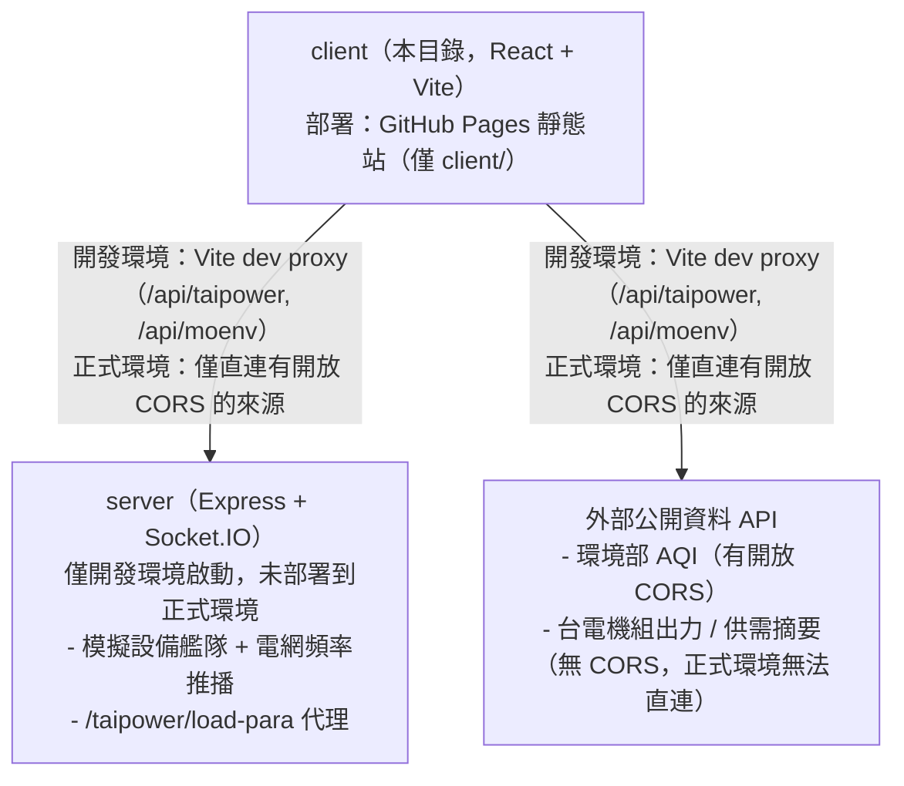

# EcoGrid EMS — Client

台灣電網即時監控儀表板（能源管理系統前端）。本文件說明技術選型與構件規範、系統架構與資料流向，供開發時參考。

## 技術選型與構件規範

| 分類 | 選型 | 說明 |
|---|---|---|
| 框架 | React `^19.2.8` | 搭配 `react-dom` |
| 語言 | TypeScript `~6.0.2` | `tsconfig.json` 採 project references（`tsconfig.app.json` / `tsconfig.node.json`） |
| 建置工具 | Vite `^8.2.2` | `@vitejs/plugin-react`；`base: './'`（GitHub Pages 子路徑部署需要相對路徑資產） |
| UI 元件系統 | shadcn/ui（`style: base-nova`） | 底層 primitive 是 **Base UI**（`@base-ui/react`），**不是 Radix** |
| CSS | Tailwind CSS v4 | CSS-first 設定，無 `tailwind.config.js`，主題 token 定義於 `src/index.css`（`@theme` / `@theme inline`） |
| 圖示 | `lucide-react` | shadcn `iconLibrary` 設定為 `lucide` |
| 狀態管理 | Zustand `^5.0.15` | `src/store/useEMSStore.ts`（設備、電網頻率、連線狀態）、`src/store/useAlertStore.ts`（告警事件） |
| 路由 | `react-router-dom ^7.18.3`（`HashRouter`） | 因部署到 GitHub Pages 靜態主機，改用 hash routing 避免重整 404 |
| 資料抓取 | `@tanstack/react-query ^5.102.8` | 每個外部資料來源包一個 `use\<Thing\>()` hook |
| 即時通訊 | `socket.io-client ^4.8.3` | 訂閱後端推播的設備狀態 / 電網頻率 |
| 圖表 | `echarts ^6.1.0`（模組化匯入）+ `recharts ^3.10.1` | 頻率折線圖用 ECharts（效能敏感，繞過 React render）；圓餅圖（發電占比）用 Recharts |
| 地圖 | `@vis.gl/react-google-maps` | Google 官方維護的 Maps JavaScript API React 綁定；用 Advanced Marker 渲染自訂 DOM 徽章，因此必須綁 Map ID 且地圖為向量模式 |
| 表格 / 虛擬滾動 | `@tanstack/react-table` + `@tanstack/react-virtual` | 用於設備清單 |
| Lint | `oxlint ^1.79.0` | 取代 ESLint，設定於 `.oxlintrc.json` |
| 測試 | 無 | 目前專案未設置測試框架 |

### 構件規範

- **路徑別名**：一律使用 `@/*`（對應 `src/*`），禁止使用 `../../` 相對路徑，設定同時存在於 `vite.config.ts` 與 `tsconfig.app.json`。
- **shadcn/ui**：`components.json` 設定 `style: base-nova`、`baseColor: neutral`、`cssVariables: true`。生成元件一律放在 `src/components/ui/`，透過 `npx shadcn@latest add` CLI 產生，**不要手改生成檔的結構**（可改樣式 / 客製 variant）。
  - Base UI 與 Radix API 差異：用 `render` prop 取代 `asChild`；`ToggleGroup` / `Accordion` 的 `value` 一律是陣列；`Select` 需額外的 `items` prop，placeholder 用 `{ value: null }` 表示。詳見 [`.claude/skills/shadcn/rules/base-vs-radix.md`](.claude/skills/shadcn/rules/base-vs-radix.md)。
- **命名慣例**：元件檔案 / 匯出用 PascalCase；hooks / lib / store 用 camelCase 並以 `use` 開頭（`useEMSStore`、`useTheme`、`useGeolocation`）；Zustand selector 一律以 `select` 開頭並與對應 store 一起匯出（`selectLatestFrequency`、`selectTotalOutputKw`）。
- **不使用 barrel file**（無 `index.ts` 匯總匯出），一律直接 import 來源檔案。
- **樣式**：以 Tailwind utility class 為主，變體樣式用 `class-variance-authority`（`cva`），合併 class 用 `cn()`（`src/lib/utils.ts`，包 `clsx` + `tailwind-merge`）。
- **資料驗證**：串接外部開放資料時要寫對應的 `parse*()` 函式做欄位防呆（見下方「已知資料怪癖」），不要直接假設回傳結構穩定。

### 目錄結構

```
src/
  api/            taipower.ts, moenv.ts        # react-query hooks，每個外部資料源一支
  components/
    dashboard/    AirQualityCard, FrequencyChart, GenerationMixChart,
                   GeneratorMixCard, KpiCard, PowerSupplyCard
    equipment/    EquipmentDetail, EquipmentRow
    map/          StationMap, StationMarker, StationInfoWindow, MapLegend
    layout/       AppShell.tsx                  # 側邊欄殼、主題切換、連線狀態徽章
    ui/           shadcn/ui 生成元件（badge, button, card, dialog, sidebar, table ...）
  hooks/          use-mobile.ts, useTheme.ts
  lib/            alertMeta.ts, aqiScale.ts, csv.ts, equipmentMeta.ts, geo.ts,
                   mapConfig.ts, queryClient.ts, socket.ts, useGeolocation.ts,
                   useSocketBridge.ts, utils.ts
  pages/          AlertLogsPage.tsx, DashboardPage.tsx, EquipmentPage.tsx, MapPage.tsx
  store/          useAlertStore.ts, useEMSStore.ts        # Zustand
  types/          alerts.ts, aqi.ts, equipment.ts, socket.ts, taipower.ts
```

路由未獨立成 `router/` 資料夾，直接在 `App.tsx` 內以 `HashRouter` 宣告四條路徑：`/`（Dashboard）、`/map`、`/equipment`、`/alerts`。

### 環境地圖頁（`/map`）

把儀表板「空氣品質」卡片背後那份環境部測站資料（全台約 84–86 站，每筆自帶經緯度）攤到地圖上，一次看完全台分布：

- **Marker**：Advanced Marker 渲染自訂 DOM，圓形徽章直接顯示數值，底色是環境部官方六級色階（定義在 [`src/lib/aqiScale.ts`](src/lib/aqiScale.ts)）。
- **縣市聚合**：縮放層級低於 `CLUSTER_ZOOM_THRESHOLD` 時，測站依 `county` 聚合成一顆縣市 marker（聚合邏輯在 [`src/lib/countyGroups.ts`](src/lib/countyGroups.ts)），顯示該縣市平均值與測站數，否則全台視野下 80 幾個徽章會互相遮蔽。平均只計入有測值的測站；點擊聚合會 `fitBounds` 到該縣市的測站範圍並展開成個別測站。
- **指標切換**：AQI / PM2.5 / PM10 / O₃(8hr)。四個指標各有自己的分級斷點（取自環境部 AQI 副指標濃度對照表），所以切換後同一組顏色仍代表同一種健康風險等級。O₃ 用 8 小時移動平均而非小時值，與 AQI 的算法一致。
- **InfoWindow**：關掉 API 原生標題列（`headerDisabled`）自行渲染 React 內容，外框顏色靠覆寫 Google 的 class 融入主題，覆寫規則與注意事項見 [`src/index.css`](src/index.css) 底部。
- **自動定位**：沿用 `useGeolocation` + `haversineDistanceKm`，進頁面後自動選中最近測站，行為與 `AirQualityCard` 一致。
- **降級**：測站資料抓不到時顯示提示畫面而非白屏，其他頁面不受影響。

## Google Maps 設定

金鑰與 Map ID 都會出現在前端 bundle 裡——這是 Maps JavaScript API 的運作方式，不是疏漏。**保護方式不是把它藏起來，而是限制它只能從本站網域使用**，所以下面第 2、4 步不能跳過。

1. **建立專案並啟用 API**：在 [Google Cloud Console](https://console.cloud.google.com/) 建立專案，綁定帳單帳戶（不綁的話地圖會蓋上 "For development purposes only" 浮水印），到「API 和服務 → 程式庫」啟用 **Maps JavaScript API**（只需要這一個）。
2. **建立並鎖定金鑰**：「憑證 → 建立憑證 → API 金鑰」。建好後點進去設定：
   - 應用程式限制選「網站」，加入 `http://localhost:5173/*` 與 `https://<帳號>.github.io/eco-grid-ems/*`
   - API 限制選「限制金鑰」，只勾 Maps JavaScript API
3. **建立 Map ID**：「Google Maps Platform → 地圖管理 → 建立地圖 ID」，地圖類型選 **JavaScript**、轉譯類型選 **向量**。Advanced Marker 只在向量地圖上支援，這步是必要的。
4. **設每日配額上限**：「Maps JavaScript API → 配額」設一個可接受的上限，避免金鑰外流時被刷爆。
5. **填入設定**：本機寫進 `client/.env`（見 [`.env.example`](.env.example)）；部署則加到 GitHub repo 的 Settings → Secrets and variables → Actions，名稱為 `VITE_GOOGLE_MAPS_API_KEY` 與 `VITE_GOOGLE_MAPS_MAP_ID`，workflow 會在 build 時注入。

## 系統架構



- **前後端關係**：`server/` 是純記憶體內的 Node/Express + Socket.IO 服務，**沒有資料庫**，職責只有兩個：(1) 產生模擬設備艦隊與電網頻率並用 Socket.IO 即時推播；(2) 代理無法被 Vite dev proxy 直連的台電 `loadpara.json`（該站 WAF 會擋掉 proxy 連線特徵，詳見 [`CLAUDE.md`](CLAUDE.md)）。
- **部署拓樸**：GitHub Actions（[`.github/workflows/deploy-gh-pages.yml`](../.github/workflows/deploy-gh-pages.yml)）只建置並部署 `client/` 到 GitHub Pages；`server/` **不會被部署**。因此正式環境是純靜態站，僅能直接呼叫「本身有開放 CORS」的公開 API。
- **正式環境資料來源限制**（對應 commit「正式環境改打真正的公開資料來源」）：
  - 環境部空氣品質 API（`data.moenv.gov.tw`）回應 `Access-Control-Allow-Origin: *`，可從瀏覽器直連 → 正式環境可用。
  - 台電機組出力明細 / 電力供需摘要（`service.taipower.com.tw` / `www.taipower.com.tw`）皆無 CORS 標頭，瀏覽器會擋 → **正式環境無法直連**，機組出力明細目前僅開發環境可用（走 Vite proxy），供需摘要需另行部署 `server/` 才能使用，這是已知架構限制，非疏漏。

## 資料流向

### 即時推播（電網頻率 → 圖表）

```
server: setInterval(1s) → nextGridFrequency()
  → Socket.IO emit "grid:frequency_tick" { frequency, timestamp }
      → client: src/lib/socket.ts（單例 socket 連線，自動重連）
        → src/lib/useSocketBridge.ts（App.tsx 掛載一次）訂閱事件
          → useEMSStore.getState().pushFrequencyTick(tick)（存入上限 120 筆的 frequencyHistory）
            → FrequencyChart.tsx：useEffect 直接 useEMSStore.subscribe(...)（繞過 React re-render）
              → chart.setOption() 命令式更新 ECharts 實例
```

設備狀態（`equipment:snapshot` / `equipment:status_update`）與告警（`alert:broadcast`）走相同模式，分別更新 `useEMSStore` 與 `useAlertStore`。

### REST 拉取（開放資料 → 卡片）

```
src/api/*.ts：use<Thing>() hook（react-query useQuery）
  → queryFn 內 fetch() 呼叫開放資料 API（開發走 /api/taipower、/api/moenv proxy；
     正式環境視 CORS 支援情況直連或透過 server 代理）
    → parse*()（parseGeneratorUnits / parseLoadPara ...）做欄位防呆與正規化
      → react-query 快取（src/lib/queryClient.ts：staleTime 30s、retry 2、無 focus 自動重抓）
        → 卡片元件消費（PowerSupplyCard、AirQualityCard、GeneratorMixCard）
```

各資料源輪詢間隔：電力供需摘要 60s，機組出力明細 / 空氣品質 300s。

### 已知資料怪癖（消費開放資料前務必留意）

- 台電機組出力明細（`aaData`）：陣列中混有「小計」列，部分分類欄位殘留來源網頁 HTML 標籤 → 一律透過 `parseGeneratorUnits()` 消費，不要直接迭代。
- `loadpara.json`：`curr_load` 單位是「萬瓩」，換算 MW 需 ×10；`records` 內混有多種形狀的物件，需以欄位是否存在判斷，不能用陣列索引。
- 環境部 AQI（`aqx_p_432`）回傳**裸陣列**，沒有 `records` 外層包裝。

更多開發過程中的踩坑細節（Vite proxy 被 WAF 擋、shadcn CLI 已知問題等）見 [`CLAUDE.md`](CLAUDE.md)。

## 開發

```bash
pnpm install
pnpm dev          # 於 repo 根目錄同時啟動 client + server
```

環境變數見 [`.env.example`](.env.example)：`VITE_SOCKET_URL`、`VITE_API_BASE_URL`（皆指向本地 `server`）、`VITE_MOENV_API_KEY`，以及地圖頁用的 `VITE_GOOGLE_MAPS_API_KEY` / `VITE_GOOGLE_MAPS_MAP_ID`（申請步驟見上方「Google Maps 設定」，未填不影響其他頁面）。正式環境變數見 [`.env.production`](.env.production)（僅設定 `VITE_MOENV_BASE_URL`，原因見上方「正式環境資料來源限制」）。
